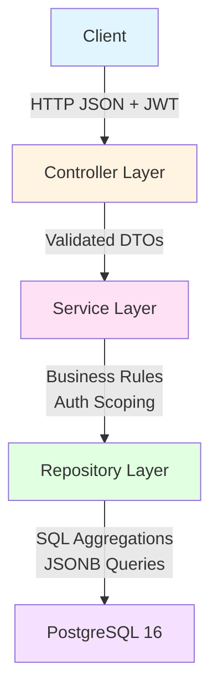
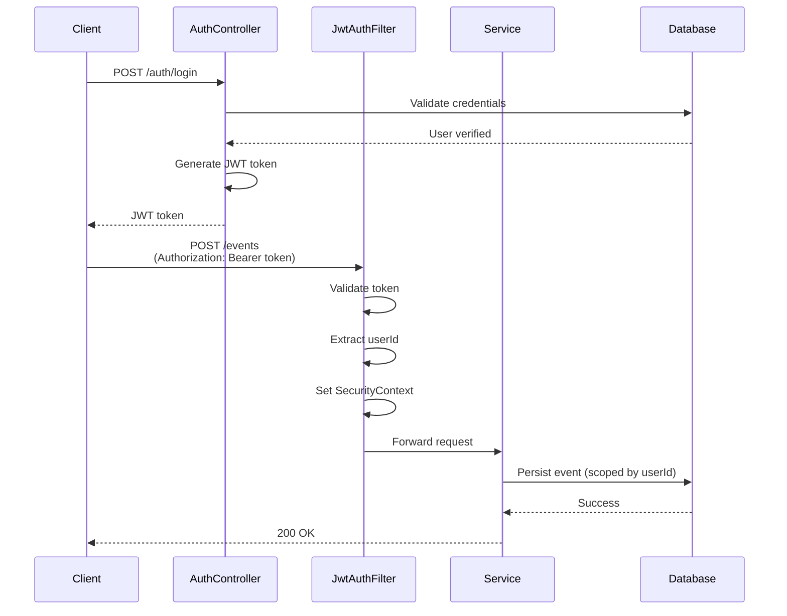
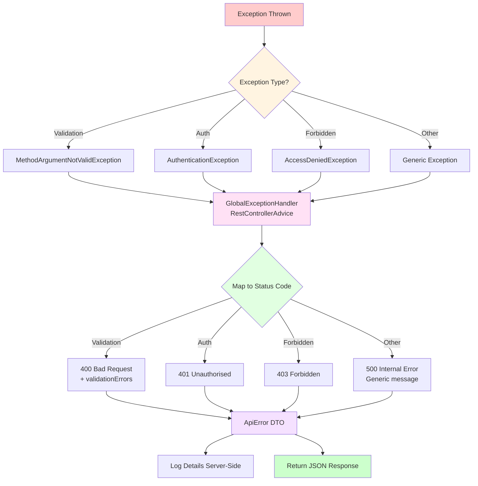
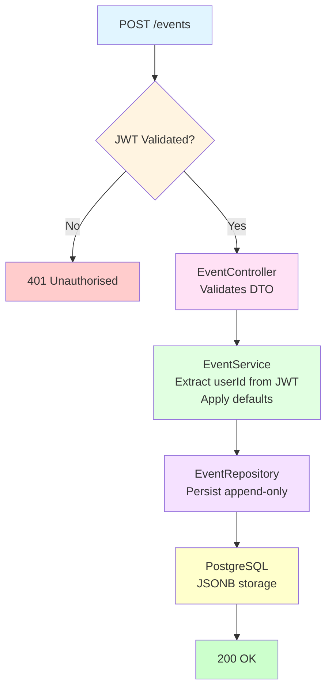
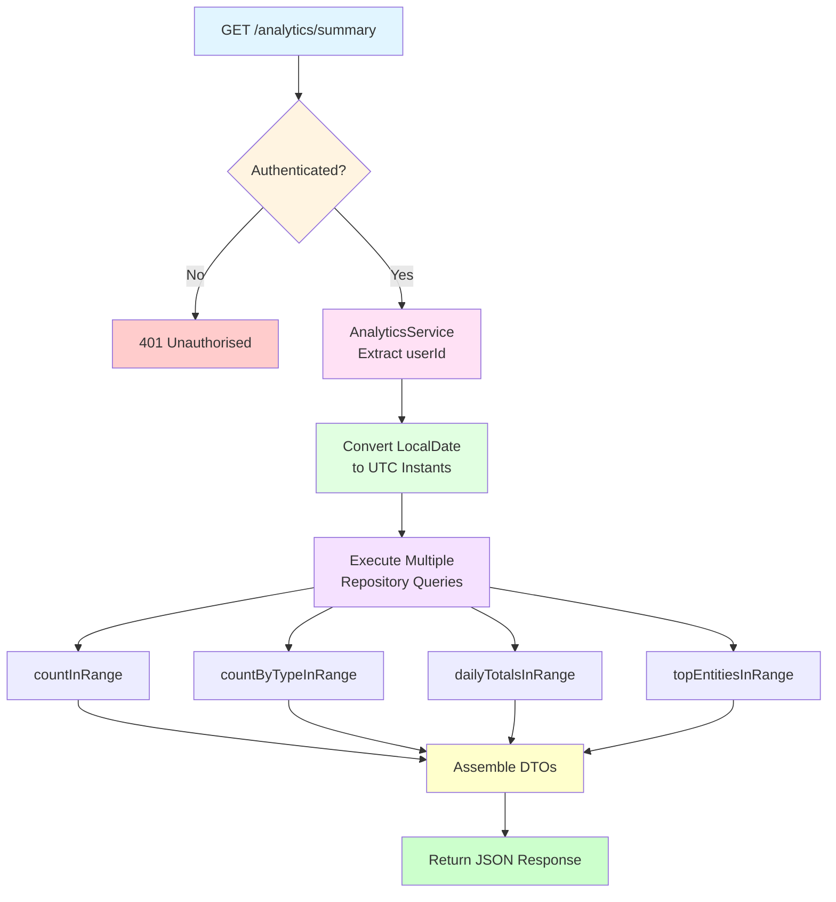
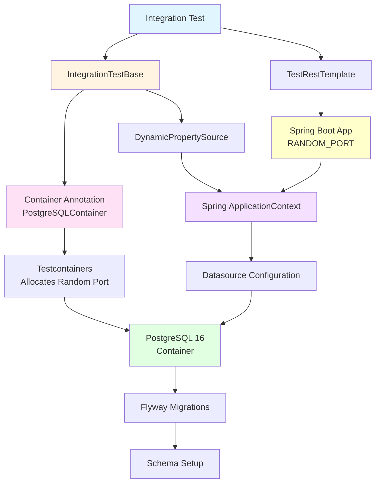
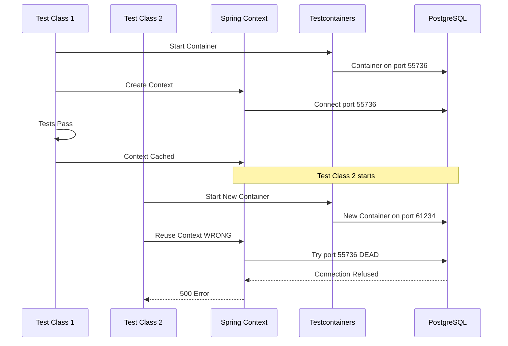
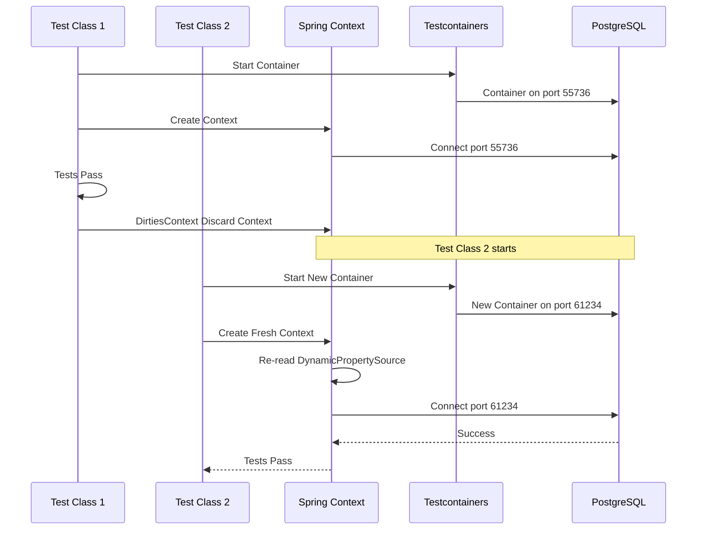

# Event Analytics & Processing API - Architecture Overview

A comprehensive technical overview of a production-style Spring Boot backend API focused on event ingestion and read-heavy analytics, demonstrating non-CRUD architecture patterns and real-world problem-solving.

---

## Table of Contents

1. [Architecture Overview](#architecture-overview)
2. [Design Principles & Considerations](#design-principles--considerations)
3. [Implementation Journey](#implementation-journey)
4. [Issues Encountered & Solutions](#issues-encountered--solutions)
5. [Testing Strategy](#testing-strategy)
6. [Final System Capabilities](#final-system-capabilities)
7. [Troubleshooting Guide](#troubleshooting-guide)

---

## Architecture Overview

### High-Level System Architecture



### Core Components

**Layered Architecture:**
- **Controllers**: Handle HTTP concerns only, delegate to services
- **Services**: Own business rules, orchestrate repository calls, enforce security scoping
- **Repositories**: Data access boundary, SQL-first analytics queries
- **Entities**: JPA domain models with proper JSONB mapping
- **DTOs**: Public API contracts, validation at boundaries

**Key Technologies:**
- Spring Boot 3.5.10 (Java 21)
- PostgreSQL 16 with JSONB support
- JWT stateless authentication
- Flyway database migrations
- Testcontainers for integration testing

---

## Design Principles & Considerations

### 1. Stateless Authentication

**Design Decision:** JWT-based authentication with no server-side sessions.

**Why:**
- Enables horizontal scaling without session affinity
- Reduces server memory footprint
- Simplifies deployment (no session store required)

**Implementation:**
- Token issued on login with `userId` in subject claim
- Custom `JwtAuthFilter` validates tokens and populates `SecurityContext`
- All subsequent requests extract `userId` from principal for data scoping

**Authentication Flow:**


**Key Considerations:**
- Must validate issuer, expiration, and signature
- Use UUIDs (not emails) as user identity (emails can change)
- Ensure `STATELESS` session policy to prevent accidental session creation

### 2. Append-Only Event Log

**Design Decision:** Events are immutable once written; no update/delete operations.

**Why:**
- Enables auditability and event replay
- Simplifies analytics correctness (no retroactive changes)
- Avoids complex update/delete semantics
- Foundation for event sourcing patterns

**Implementation:**
- `EventEntity` has no update methods exposed
- Repository only provides `save()` for new events
- `occurredAt` represents event time; `createdAt` represents ingestion time

### 3. SQL-First Analytics

**Design Decision:** All aggregations performed in PostgreSQL, not in application memory.

**Why:**
- Databases are optimised for aggregation operations
- Avoids loading large datasets into memory (O(n) memory/time)
- Scales better than in-application counting
- Leverages database indexing and query optimisation

**Implementation:**
- Native SQL queries in `EventRepository` using `@Query`
- Projection interfaces for type-safe results
- Queries scoped by `user_id` for tenant isolation
- Deterministic ordering for stable API responses

**Key Considerations:**
- Use `>= startInclusive AND < endExclusive` for time ranges (prevents double-counting)
- Always include `user_id` in WHERE clauses (security boundary)
- Order by count DESC, then by entity fields ASC for deterministic tie-breaking

### 4. UTC Date Range Semantics

**Design Decision:** Explicit inclusive/exclusive date range handling in UTC.

**Why:**
- Prevents off-by-one errors in date queries
- Ensures consistent daily grouping across time zones
- Matches industry-standard analytics semantics

**Implementation:**
```java
startInclusive = from.atStartOfDay(ZoneOffset.UTC).toInstant()
endExclusive = to.plusDays(1).atStartOfDay(ZoneOffset.UTC).toInstant()
```

This guarantees:
- `from=2026-01-01&to=2026-01-01` covers exactly that day
- No overlaps between adjacent queries
- Correct daily grouping alignment

### 5. Projection-Based Queries

**Design Decision:** Use projection interfaces instead of full entities for analytics.

**Why:**
- Reduces memory usage (only fetch needed columns)
- Makes intent explicit (read-only analytics)
- Improves query performance
- Prevents accidental entity modification

**Implementation:**
- `TypeCountProjection`, `DailyTotalProjection`, `EntityCountProjection`
- Service layer maps projections to DTOs
- Never expose database schema directly to API consumers

### 6. Global Error Handling

**Design Decision:** Centralised exception handling via `@RestControllerAdvice`.

**Why:**
- Consistent error response format across all endpoints
- Prevents leaking internal details (security)
- Makes testing predictable
- Reduces repetitive try/catch blocks

**Implementation:**
- Standard error DTO with `timestamp`, `status`, `error`, `message`, `path`
- Field-level `validationErrors` map for validation failures
- Status code mapping: 400 (validation), 401 (unauthorised), 403 (forbidden), 500 (generic)

**Error Handling Flow:**


---

## Implementation Journey

### Step 1-3: Foundation & Infrastructure

**What Was Built:**
- Spring Boot project structure with clean package organisation
- Docker Compose setup for local PostgreSQL
- Environment variable configuration (no hardcoded secrets)
- Flyway migrations for schema versioning

**Why:**
- Reproducible local development environment
- Mirrors production deployment patterns
- Enables Testcontainers integration later

### Step 4: JWT Authentication

**What Was Built:**
- User registration and login endpoints
- BCrypt password hashing
- JWT token issuance and validation
- Custom `JwtAuthFilter` for request authentication

**Key Learnings:**
- JWT flow: issue token → validate in filter → populate SecurityContext
- Passwords always hashed with BCrypt, never stored or compared raw
- Stateless auth = JWT + `STATELESS` session policy

**Common Pitfalls Avoided:**
- Not validating issuer/expiration (would accept forged tokens)
- Using email as identity (emails change; UUIDs don't)
- Accidentally creating sessions (defeats stateless design)

### Step 5: Event Ingestion

**What Was Built:**
- `POST /events` endpoint with JWT authentication
- `EventEntity` JPA mapping with JSONB metadata
- `EventService` with business rules (userId extraction, defaults)
- DTO validation at controller boundary

**Architecture Flow:**


**Key Decisions:**
- **Server-controlled UUIDs**: Client doesn't control primary keys
- **Event time vs ingestion time**: `occurredAt` (event time) vs `createdAt` (ingestion time)
- **Optional metadata**: Stored as JSONB for flexible querying
- **User scoping**: `userId` extracted from JWT, never from request body

**Common Pitfalls Avoided:**
- Accepting `userId` in request body (serious security bug)
- Making events mutable (breaks audit + analytics)
- Skipping validation (relying on DB errors is poor UX)

### Step 6: Analytics Queries (SQL-First)

**What Was Built:**
- Native SQL aggregation queries in `EventRepository`
- Four core analytics queries:
  1. Total events in range
  2. Counts by event type
  3. Daily totals (UTC day buckets)
  4. Top-K entities (overall and by type)

**Query Examples:**

**Total Events:**
```sql
SELECT COUNT(*) 
FROM events 
WHERE user_id = ? 
  AND occurred_at >= ? 
  AND occurred_at < ?
```

**Counts by Type:**
```sql
SELECT type, COUNT(*) as count
FROM events
WHERE user_id = ? 
  AND occurred_at >= ? 
  AND occurred_at < ?
GROUP BY type
ORDER BY count DESC, type ASC
```

**Daily Totals (UTC):**
```sql
SELECT (occurred_at AT TIME ZONE 'UTC')::date as date, COUNT(*) as count
FROM events
WHERE user_id = ? 
  AND occurred_at >= ? 
  AND occurred_at < ?
GROUP BY date
ORDER BY date ASC
```

**Top Entities:**
```sql
SELECT entity_type, entity_id, COUNT(*) as count
FROM events
WHERE user_id = ? 
  AND occurred_at >= ? 
  AND occurred_at < ?
GROUP BY entity_type, entity_id
ORDER BY count DESC, entity_type ASC, entity_id ASC
LIMIT ?
```

**Why This Approach:**
- No events loaded into Java memory
- Database optimises aggregation
- Deterministic ordering ensures stable API responses
- Multi-tenant scoping via `user_id` in every query

### Step 7: Analytics Service & API

**What Was Built:**
- `AnalyticsService` orchestrates multiple repository queries
- Date range conversion (LocalDate → UTC Instants)
- DTO assembly from projections
- Two analytics endpoints:
  - `GET /analytics/summary` - Comprehensive analytics dashboard
  - `GET /analytics/top` - Top-K entities by event type

**Service Responsibilities:**
1. Extract authenticated `userId` (security scoping)
2. Convert `LocalDate` from/to into UTC `Instant` bounds
3. Call multiple repository queries
4. Assemble DTOs into required JSON response shapes

**Why Service Layer Orchestration:**
- Repositories answer "data questions" but shouldn't know about API formats
- Single source of truth for date range conversion
- Enforces API-level rules (limit clamping, validation)

**Analytics Processing Flow:**


**Summary Endpoint Composition:**
- `totalEvents`: from `countInRange()`
- `countsByType`: from `countByTypeInRange()` → converted to `Map<String, Long>`
- `dailyTotals`: from `dailyTotalsInRange()` → mapped to DTO list
- `topEntities`: from `topEntitiesInRange(..., 5)` → mapped to DTO list

### Step 8: Global Error Handling

**What Was Built:**
- `@RestControllerAdvice` for centralised exception handling
- Standardised error DTO (`ApiError`)
- Status code mapping policy
- Field-level validation error collection

**Error Response Format:**
```json
{
  "timestamp": "2026-01-29T12:00:00Z",
  "status": 400,
  "error": "Bad Request",
  "message": "Validation failed",
  "path": "/events",
  "validationErrors": {
    "entityId": "must not be blank"
  }
}
```

**Status Code Mapping:**
- **400**: Validation failures (`MethodArgumentNotValidException`)
- **401**: Unauthorised (missing/invalid JWT)
- **403**: Forbidden (authenticated but not allowed)
- **500**: Unexpected errors (generic message, detailed logs)

**Why This Matters:**
- Clients can parse errors reliably
- Tests can assert exact structure
- No internal details leaked (security)
- Professional API documentation

### Step 9: Integration Testing with Testcontainers

**What Was Built:**
- Testcontainers integration for real PostgreSQL in tests
- `IntegrationTestBase` abstract class with container setup
- `@DynamicPropertySource` for runtime datasource configuration
- HTTP-level integration tests using `TestRestTemplate`

**Test Scenarios Validated:**
1. **Multi-user scoping**: User A only sees their events, User B only sees theirs
2. **Date range correctness**: UTC conversion and exclusive end logic
3. **Top-K correctness**: Ordering and counts for top entities
4. **Error handling**: Consistent JSON error responses

**Why Testcontainers:**
- Tests against real PostgreSQL (not H2)
- Validates Postgres-specific behaviours (JSONB, timestamp semantics)
- No reliance on developer machine setup
- Schema migrations validated automatically

**Testcontainers Architecture:**


---

## Issues Encountered & Solutions

### Issue 1: JSONB Mapping Failure

**Symptom:**
```
column "metadata" is of type jsonb but expression is of type character varying
```

**Root Cause:**
- Hibernate was sending metadata as VARCHAR (string)
- PostgreSQL expected JSONB type
- `@Column(columnDefinition="jsonb")` alone is insufficient

**Solution:**
- Added Hypersistence Utils dependency (`hypersistence-utils-hibernate-63`)
- Annotated entity field with proper JSONB type mapping:
  ```java
@Type(JsonType.class)
@Column(columnDefinition = "jsonb")
private Map<String, Object> metadata;
  ```

**Why This Matters:**
- JSONB isn't "just a string column"
- Without correct mapping, inserts fail and future JSON queries won't work
- Must use correct Hypersistence version matching Hibernate 6.x

### Issue 2: Testcontainers Context Reuse Failure

**Symptom:**
- Hikari connection validation warnings: "connection has been closed"
- Connection refused to random port (e.g., `localhost:55736`)
- `/auth/register` returning 500 due to DB connection failure
- Tests failing with unexpected 500 instead of 200/409

**Root Cause:**
- Spring Boot was reusing `ApplicationContext` across multiple test classes
- Testcontainers Postgres instance port mapping wasn't guaranteed valid across context reuse
- Spring context still pointing at dead container port
- Hikari trying to use stale connections

**Problem Visualisation:**



**Solution:**
- Added `@DirtiesContext(classMode = DirtiesContext.ClassMode.AFTER_CLASS)` to integration test classes
- Forces Spring to discard context after test class completes
- Next test class gets fresh context that re-reads `@DynamicPropertySource`
- Fresh datasource built using currently running container's JDBC URL

**Solution Visualisation:**



**Why This Works:**
- Prevents stale datasource/port reuse
- Aligns Spring context lifecycle with container lifecycle
- Removes flaky cross-class DB connectivity issues

**Key Learning:**
- ApplicationContext lifecycle and container lifecycle must match
- "Connection refused localhost:<randomPort>" in tests usually means pointing at dead container

### Issue 3: JWT Token Validation After Restart

**Symptom:**
- Tokens issued before application restart failing validation
- 401 responses with valid-looking tokens

**Root Cause:**
- JWT secret changed on restart (if using random secret)
- Old tokens signed with different secret no longer validate

**Solution:**
- Use stable JWT secret in test configuration
- In production, use environment variable for consistent secret
- Tokens are invalidated on secret change (by design for security)

**Prevention:**
- Always use stable secrets in test environments
- Document secret rotation procedures for production

---

## Testing Strategy

### Unit Testing
- Service layer logic (date range conversion, DTO mapping)
- Repository query correctness (SQL validation)
- Validation rules

### Integration Testing (Testcontainers)

**Setup:**
- `IntegrationTestBase` provides PostgreSQL container
- `@DynamicPropertySource` wires container JDBC URL to Spring
- Flyway runs automatically on context startup
- Stable JWT configuration for deterministic tokens

**Test Coverage:**
1. **End-to-End HTTP Flow:**
   - Register → Login → Create Event → Query Analytics
   - Validates all layers: Security → Controller → Service → Repository → DB

2. **Multi-Tenant Isolation:**
   - Create two users with separate tokens
   - Insert events for both users
   - Query analytics as each user → verify only own events returned

3. **Date Range Semantics:**
   - Insert events with known `occurredAt` timestamps
   - Query specific date ranges
   - Verify UTC conversion and exclusive end logic

4. **Error Handling:**
   - Validation failures return 400 with field errors
   - Unauthorised requests return 401
   - Consistent JSON error format

**Key Testing Considerations:**
- Use `@DirtiesContext` to prevent context reuse issues
- Test against real PostgreSQL (not H2) for accuracy
- Validate Postgres-specific features (JSONB, timezone handling)
- Test security boundaries (user scoping) explicitly

---

## Final System Capabilities

### Authentication & Authorisation
- User registration with email/password
- JWT-based stateless authentication
- Automatic user scoping for all data operations
- Secure password hashing (BCrypt)

### Event Ingestion
- `POST /events` - Append-only event logging
- Flexible metadata storage (JSONB)
- Automatic timestamp handling
- Input validation at API boundary
- User ownership enforced via JWT

### Analytics API

**Summary Analytics:**
- `GET /analytics/summary?from=YYYY-MM-DD&to=YYYY-MM-DD`
- Returns:
  - Total event count
  - Counts by event type (map)
  - Daily totals (time series)
  - Top 5 entities overall

**Top-K Analytics:**
- `GET /analytics/top?type=EVENT_TYPE&from=YYYY-MM-DD&to=YYYY-MM-DD&limit=N`
- Returns most active entities for a specific event type
- Limit clamped to 1-100 range

**Analytics Features:**
- SQL-first aggregation (no in-memory processing)
- UTC date range handling (inclusive start, exclusive end)
- Deterministic ordering (stable API responses)
- Multi-tenant isolation (user-scoped queries)
- Efficient projection-based queries

### Error Handling
- Consistent JSON error responses
- Field-level validation errors
- Appropriate HTTP status codes
- No internal details leaked
- Centralised exception handling

### Database Features
- Flyway schema versioning
- JSONB metadata querying
- Efficient aggregation queries
- Indexed queries for performance
- Append-only event log

---

## Troubleshooting Guide

### Connection Issues

**Problem:** "Connection refused" errors
- **Check:** Database container is running (`docker-compose ps`)
- **Check:** Environment variables match container configuration
- **Check:** Port conflicts (default: 5433)

**Problem:** "Connection has been closed" in tests
- **Solution:** Add `@DirtiesContext` to test classes
- **Check:** Testcontainers container is still running

### Authentication Issues

**Problem:** 401 Unauthorised with valid-looking token
- **Check:** JWT secret matches between token issuance and validation
- **Check:** Token hasn't expired
- **Check:** Token issuer matches configuration
- **Solution:** Issue new token after application restart if secret changed

**Problem:** Tokens work in one environment but not another
- **Check:** JWT secret environment variable is set consistently
- **Check:** Issuer configuration matches

### JSONB Issues

**Problem:** "column metadata is of type jsonb but expression is of type character varying"
- **Solution:** Ensure Hypersistence Utils dependency is included
- **Check:** Entity field has `@Type(JsonType.class)` annotation
- **Check:** Hypersistence version matches Hibernate version

### Analytics Query Issues

**Problem:** Off-by-one errors in date ranges
- **Check:** Using inclusive start (`>=`) and exclusive end (`<`)
- **Check:** UTC conversion is correct
- **Verify:** `to + 1 day` logic in service layer

**Problem:** Cross-user data leakage
- **Check:** All queries include `user_id = ?` in WHERE clause
- **Check:** `userId` extracted from SecurityContext, not request
- **Verify:** Integration tests validate multi-user isolation

### Test Failures

**Problem:** Flaky tests with connection errors
- **Solution:** Add `@DirtiesContext(classMode = AFTER_CLASS)`
- **Check:** Testcontainers container lifecycle matches Spring context
- **Verify:** `@DynamicPropertySource` is correctly configured

**Problem:** Tests pass locally but fail in CI
- **Check:** Docker/Testcontainers available in CI environment
- **Check:** Sufficient resources allocated for containers
- **Verify:** Environment variables set correctly

---

## Conclusion

This system demonstrates production-ready backend architecture with:

- **Non-CRUD focus**: Event ingestion and read-heavy analytics
- **Security**: JWT-based stateless authentication with proper scoping
- **Performance**: SQL-first analytics avoiding in-memory processing
- **Reliability**: Comprehensive error handling and testing
- **Maintainability**: Clean layering, proper abstractions, documented decisions

The implementation journey included real-world problem-solving (JSONB mapping, context lifecycle management) and production considerations (error handling, testing strategy, security boundaries).

This architecture scales horizontally, maintains data integrity, and provides a solid foundation for extending analytics capabilities.
