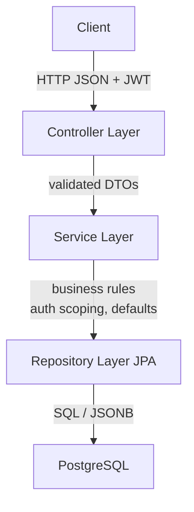
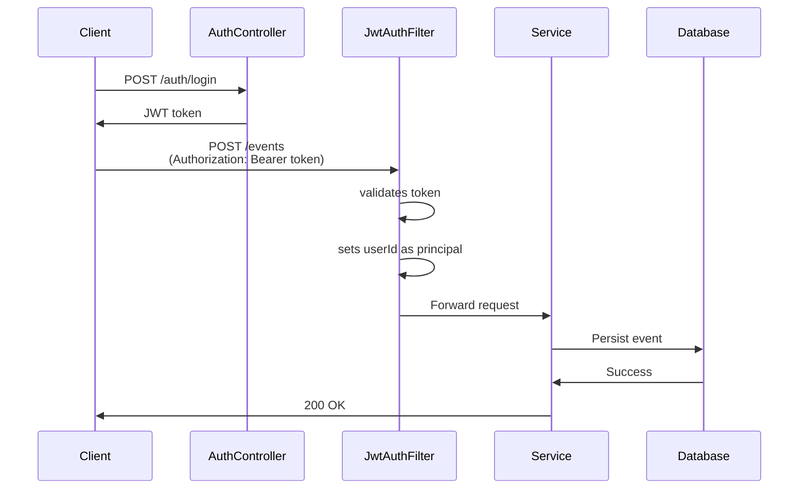
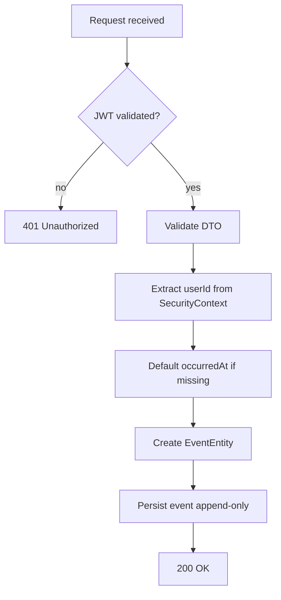

# Event Analytics & Processing API

A production-style Spring Boot 3 backend API focused on event ingestion and analytics, built with stateless JWT authentication and PostgreSQL JSONB support.

##  Architecture



### Design Principles

- **Controllers are thin** - Handle HTTP concerns only
- **Services own rules** - Business logic lives in the service layer
- **Database is the source of truth** - No in-memory state
- **Analytics are SQL-first** - Efficient aggregations at the database level

## Tech Stack

- **Spring Boot 3.5.10** (Java 21)
- **PostgreSQL 16** with JSONB support
- **JWT** stateless authentication
- **Flyway** database migrations
- **Maven** build system
- **Docker Compose** for local development

## Project Structure

```
src/main/java/com/example/eventanalytics/
├── config/          # Security, JWT configuration
├── controller/      # REST endpoints
├── service/         # Business logic
├── repo/            # Data access layer
├── domain/entity/   # JPA entities
├── dto/             # Data transfer objects
└── exception/       # Exception handling
```

## Database Schema

### Users Table
```sql
id            UUID PRIMARY KEY
email         VARCHAR(UNIQUE)
password_hash VARCHAR
created_at    TIMESTAMP
```

### Events Table
```sql
id           UUID PRIMARY KEY
user_id      UUID (FK to users)
type         VARCHAR(64)
entity_type  VARCHAR(64)
entity_id    VARCHAR(128)
occurred_at  TIMESTAMP
metadata     JSONB
created_at   TIMESTAMP
```

## Authentication

Stateless JWT-based authentication with no sessions or cookies.

### Endpoints

- `POST /auth/register` - Register a new user
- `POST /auth/login` - Authenticate and receive JWT token

### Authentication Flow



This enables horizontal scaling with server-side user identity enforcement and prevents cross-user data leakage.

## Event Ingestion

### Endpoint

```
POST /events
Authorization: Bearer <JWT>
```

### Request Payload

```json
{
  "type": "TASK_CREATED",
  "entityType": "TASK",
  "entityId": "123",
  "occurredAt": "2026-01-29T12:00:00Z",
  "metadata": { "priority": "HIGH" }
}
```

### Event Processing Flow



## Setup & Installation

### Prerequisites

- Java 21
- Maven 3.8+
- Docker & Docker Compose
- PostgreSQL 16 (via Docker)

### Running Locally

1. **Start the database:**
   ```bash
   docker-compose up -d
   ```

2. **Configure environment variables** (optional, defaults provided):
   ```bash
   export DB_HOST=localhost
   export DB_PORT=5433
   export DB_NAME=event_analytics
   export DB_USERNAME=app
   export DB_PASSWORD=app
   export JWT_SECRET=your-secret-key-min-32-chars
   ```

3. **Run the application:**
   ```bash
   ./mvnw spring-boot:run
   ```

The API will be available at `http://localhost:8080`

## API Examples

### Register a User

```bash
curl -X POST http://localhost:8080/auth/register \
  -H "Content-Type: application/json" \
  -d '{
    "email": "user@example.com",
    "password": "Password123"
  }'
```

### Login

```bash
curl -X POST http://localhost:8080/auth/login \
  -H "Content-Type: application/json" \
  -d '{
    "email": "user@example.com",
    "password": "Password123"
  }'
```

### Create an Event

```bash
curl -X POST http://localhost:8080/events \
  -H "Authorization: Bearer <YOUR_JWT_TOKEN>" \
  -H "Content-Type: application/json" \
  -d '{
    "type": "TASK_CREATED",
    "entityType": "TASK",
    "entityId": "123",
    "metadata": {
      "priority": "HIGH"
    }
  }'
```

## 🔍 Key Features

### JSONB Support

The `metadata` field uses PostgreSQL JSONB for flexible, queryable JSON storage:

```java
@Type(JsonType.class)
@Column(columnDefinition = "jsonb")
private Map<String, Object> metadata;
```

This enables efficient JSON queries and aggregations directly in SQL.

### Date Range Handling

Analytics queries use explicit date semantics:
- `from` = LocalDate at 00:00 UTC (inclusive)
- `to` = LocalDate + 1 day at 00:00 UTC (exclusive)

This prevents off-by-one errors and ensures consistent daily grouping across time zones.

## Testing

Run tests with:

```bash
./mvnw test
```

## Additional Documentation

See Overview.md for detailed architecture documentation and implementation notes.


